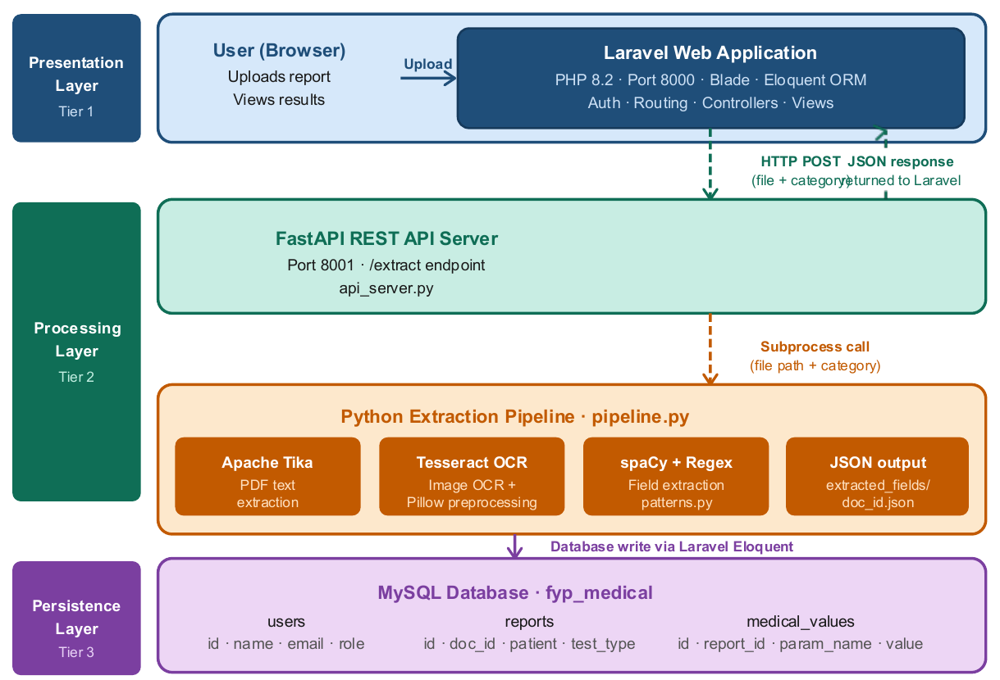
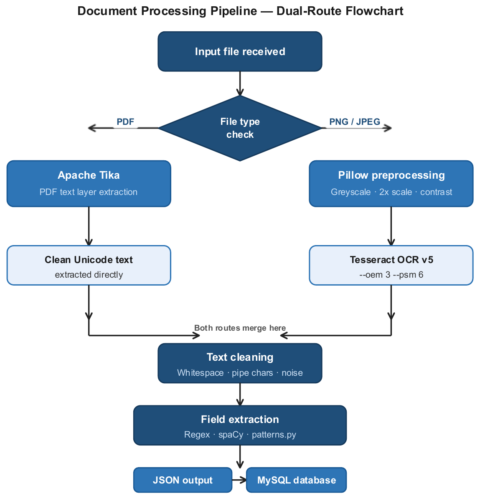
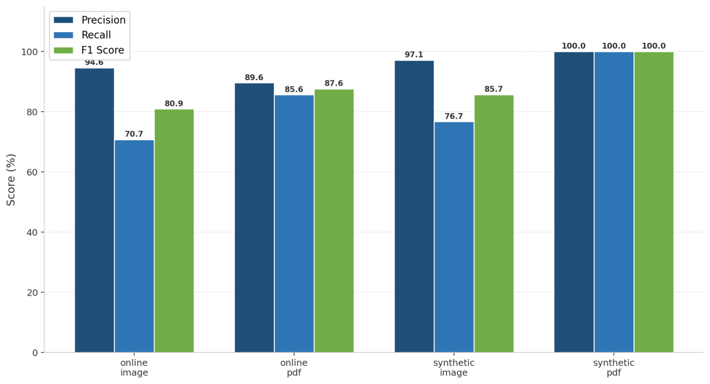
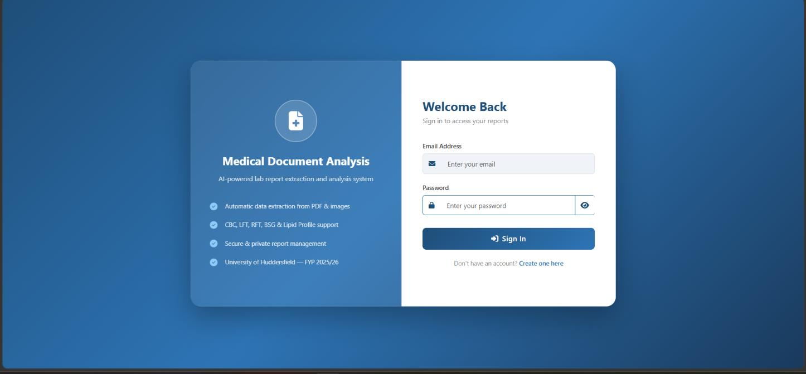
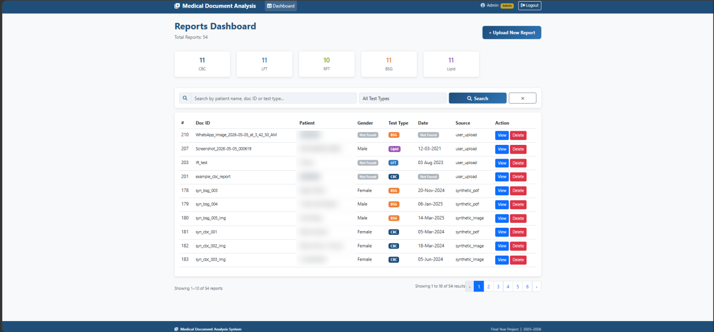
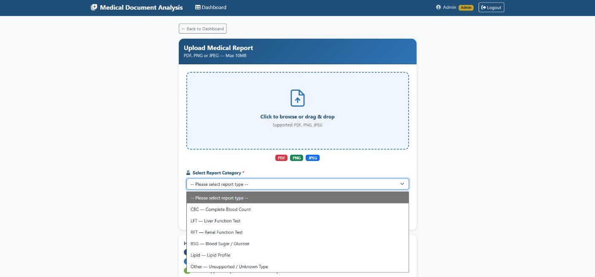
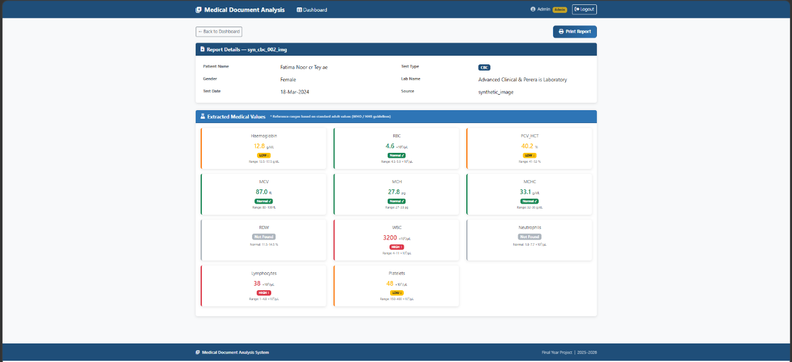

<h1 align="center">🩺 Medical Lab Report Analysis System</h1>

<p align="center">
  <b>Automatically turns PDF and image lab reports into structured, searchable medical data</b><br>
  OCR · NLP · Regex · FastAPI · Laravel · MySQL
</p>

<p align="center">
  
  
  
  
  
  
  
</p>

<p align="center">
  <b>F1 Score 90.2%</b> · <b>Precision 96.1%</b> · <b>Recall 85.0%</b> · evaluated on 50 real and synthetic lab reports
</p>

> Final Year Project, BSc (Hons) Computer Science, University of Huddersfield (2025–26). Supervised by Alla Detinko.

---

## The Problem

Many smaller clinics and laboratories still keep lab results as **paper, scanned images or PDFs**. Typing these results into a computer by hand is slow and error-prone, and the data stays hard to search or track over time. Enterprise document-processing tools exist, but they are built for large hospitals and are too costly and complex for small providers.

## The Solution

An **end-to-end, open-source pipeline** that takes a lab report as a **PDF, PNG screenshot or JPEG photo**, extracts the patient details and **34 medical parameters across 5 test types**, stores them in a relational database, and presents them in a secure, role-based web application. Each value is shown with its unit, reference range and a High / Low / Normal flag.

| Test category | Parameters |
|---|---|
| **CBC**: Complete Blood Count | 11 |
| **LFT**: Liver Function Test | 6 |
| **RFT**: Renal Function Test | 6 |
| **Lipid Profile** | 6 |
| **BSG**: Blood Sugar / Glucose | 5 |

---

## System Architecture

A **three-tier architecture** keeps the web app and the Python extraction service independent. They communicate through a **FastAPI REST API**, which replaced an earlier shell-based integration.



**Request flow:** the user uploads a report in Laravel → Laravel sends an HTTP POST (file + category) to FastAPI `/extract` → FastAPI runs the Python pipeline → the pipeline returns structured JSON → Laravel saves the results to MySQL through Eloquent → the results are shown in the dashboard.

---

## Dual-Route Extraction Pipeline

Different file types need different extraction methods, so the pipeline has two routes that merge into a shared extraction stage:



| Route | Used for | How it works |
|---|---|---|
| **PDF route** | Digitally created PDFs | **Apache Tika** reads the embedded text layer directly, giving clean Unicode text with no OCR errors |
| **Image route** | PNG screenshots and JPEG photos | **Pillow preprocessing** (greyscale, 2× Lanczos upscale, contrast boost, sharpening) followed by **Tesseract OCR v5** (`--oem 3 --psm 6`) |

**Field extraction** uses a library of **regular expression patterns** (`patterns.py`) built to handle real-world format differences: abbreviations, brackets, H/L/N and HIGH/LOW/NORMAL flags, and colon or space delimiters. **spaCy NER** is used as a secondary method for patient names. The user picks the test category on upload, so the correct pattern set is always applied.

---

## Results

The system was evaluated field by field against ground-truth labels for **50 lab reports** from four sources, using `evaluate.py`.

### Overall

| Metric | Score |
|---|---|
| **Precision** | **96.1%** |
| **Recall** | **85.0%** |
| **F1 Score** | **90.2%** |
| Field-level accuracy | 82.1% (345 / 420 fields) |

**High precision was a deliberate design choice.** In a medical setting, a wrong value is more dangerous than a missing one. When the system extracts a value, it is correct 96% of the time. Values it can't find confidently are shown as "Not Found" rather than guessed.

### By source type

| Source | Accuracy | Precision | Recall | F1 |
|---|---|---|---|---|
| Synthetic PDF | **100.0%** | 100.0% | 100.0% | **100.0%** |
| Online PDF (real lab formats) | 77.0% | 90.4% | 83.9% | 87.0% |
| Synthetic image | 75.0% | 97.1% | 76.7% | 85.7% |
| Online image | 67.9% | 96.4% | 69.7% | 80.9% |



### By test category

| Category | Precision | Recall | F1 |
|---|---|---|---|
| CBC | 97.8% | 84.1% | 90.5% |
| LFT | **100.0%** | 83.1% | **90.7%** |
| RFT | 90.6% | 87.9% | 89.2% |
| Lipid | 90.9% | 88.9% | 89.9% |
| BSG | 100.0% | 59.1% | 74.3% |

### Key findings
- **Digital PDFs are the most reliable input.** Tika reached 100% on synthetic PDFs and 89% across all PDFs.
- **OCR mainly lowers recall, not precision.** Image routes still reached about 96% precision, but missed more fields because of noise, lighting and layout.
- **BSG is the weakest category** (59% recall), because glucose tests use the widest variety of naming and layout conventions across labs. It is the top priority for future pattern improvements.

---

## Web Application

| Login | Dashboard |
|---|---|
|  |  |

| Upload | Report detail |
|---|---|
|  |  |

*Patient names in the dashboard screenshot have been blurred.*

**Features**
- **Role-based access control:** admins see every report, while users see only their own. Accessing another user's report by changing the URL returns **403 Forbidden**.
- **Upload** of PDF, PNG or JPEG files, with file-type validation and a **required test-category selection**
- **Dashboard** with colour-coded summary cards per category, **server-side search and filtering** across all records, and **pagination**
- **Report detail page** showing each value with its **unit, reference range and colour-coded High / Low / Normal status**
- **Print-friendly report view** and **report deletion** with a confirmation dialog
- **Security:** hashed passwords, CSRF protection and session regeneration on login

---

## Database Design

A normalised **three-table schema** in MySQL (`fyp_medical`). This handles the different number of parameters in each test type without empty columns.

| Table | Purpose |
|---|---|
| `users` | Account details, hashed passwords and `role` (admin / user) |
| `reports` | One row per uploaded report: patient name, gender, test date, test type, lab name, source and file type · linked to `users` |
| `medical_values` | One row per extracted parameter (`param_name`, `param_value`) · linked to `reports` with **cascade delete** |

---

## Tech Stack

| Layer | Technology |
|---|---|
| PDF text extraction | Apache Tika |
| OCR | Tesseract 5 (pytesseract) |
| Image preprocessing | Pillow |
| NLP and field extraction | Regular expressions, spaCy (`en_core_web_sm`) |
| API layer | FastAPI + Uvicorn (port 8001) |
| Web application | Laravel 11 (PHP 8.2), Blade, Bootstrap 5 |
| Database | MySQL (XAMPP) |
| Evaluation | pandas, NumPy, Matplotlib |

---

## Repository Structure

```
├── pipeline.py        # Dual-route extraction pipeline (Tika / Pillow + Tesseract → regex + spaCy → JSON)
├── patterns.py        # Regex pattern library for CBC, LFT, RFT, BSG and Lipid
├── api_server.py      # FastAPI server exposing POST /extract
├── evaluate.py        # Field-level accuracy, precision, recall and F1 evaluation + charts
├── insert_to_db.py    # Batch-inserts the evaluation dataset into MySQL
├── requirements.txt   # Python dependencies
├── schema.sql         # MySQL tables for reports and medical values
├── app/
│   ├── Http/Controllers/   # AuthController, UploadController, ReportController
│   └── Models/             # User, Report, MedicalValue
├── resources/views/        # Blade templates (login, register, dashboard, upload, report detail)
├── routes/web.php
└── database/migrations/
```

---

## Getting Started

**Requirements:** Python 3.10+, PHP 8.2+, Composer, XAMPP (MySQL), [Tesseract OCR 5](https://github.com/UB-Mannheim/tesseract/wiki), and Java (needed by Apache Tika)

**1. Python extraction service**
```bash
pip install -r requirements.txt
python -m spacy download en_core_web_sm
python -m uvicorn api_server:app --host 127.0.0.1 --port 8001
```
> On Windows, Tesseract is expected at `C:\Program Files\Tesseract-OCR\tesseract.exe`. Update `tesseract_cmd` in `pipeline.py` if you installed it somewhere else.

**2. Database**

Create a MySQL database called `fyp_medical`, then import `schema.sql` (for example, through phpMyAdmin).

**3. Laravel web app**
```bash
composer install
cp .env.example .env
php artisan key:generate
```
In `.env`, set `DB_CONNECTION=mysql` and `DB_DATABASE=fyp_medical`, and add `FASTAPI_URL=http://127.0.0.1:8001`. Then run:
```bash
php artisan migrate
php artisan serve
```
Open **http://127.0.0.1:8000**, register an account and upload a lab report.

---

## Limitations

- Supports **English**, **printed** lab reports in five test categories only
- Rule-based patterns need extending for new lab layouts (BSG recall especially)
- The FastAPI service runs locally and processes one request at a time
- A prototype for evaluation, not a certified clinical system

## Future Work

- More test types (thyroid, urine, metabolic panel)
- A **hybrid regex + machine learning** extractor with active learning for unseen formats
- **Asynchronous, authenticated API** for remote and concurrent use
- **HL7 FHIR** output for integration with electronic health records
- Multilingual support (e.g. Urdu, Arabic) and handwritten reports (e.g. TrOCR)

---

**Author:** Ayesha Sohail · [GitHub](https://github.com/ayesha112244)
